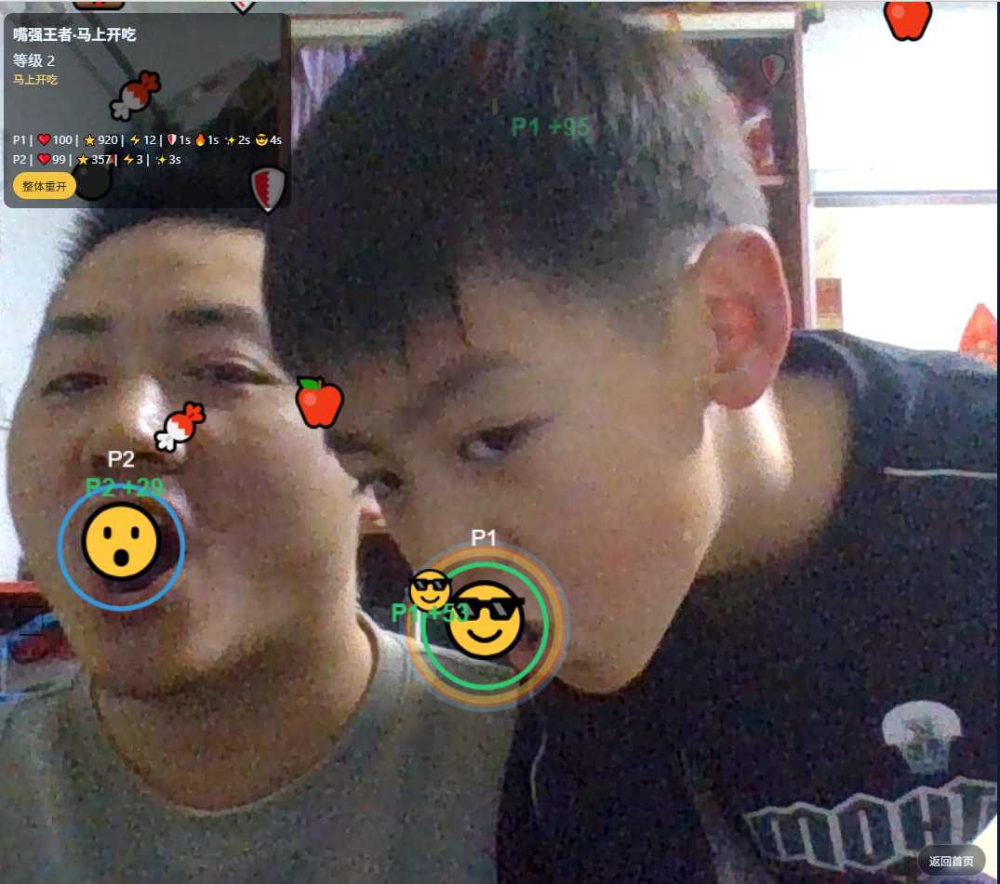

# Mouth King Game · 嘴强王者

每年春节，大家都在说“多陪陪家人”。

但现实常常是：大人刷手机，小孩抢平板，
年轻人瘫在沙发上喊“再来一把”。
 
我一直想做一件小事：
让客厅里的笑声，能被一个网页重新点燃。

于是有了这个开源小游戏项目：
Mouth King Game（嘴强王者）。


基于 `TypeScript + Vite + MediaPipe` 的多人摄像头体感小游戏。张嘴就是控制器：抢掉落、躲陷阱、连击翻盘，30 秒就能打出一局高能名场面。

在线畅玩：[https://game.liucfamily.cn](https://game.liucfamily.cn)



隐私说明：视频流仅在本地浏览器内存中运行与计算，不上传、不存储。

## 特性

- 1-4 人同屏识别与独立状态
- 主题模式切换（首页选择）
- 首页/游戏页分离，摄像头与模型在入局后加载
- 评论系统（Twikoo）接入，支持 Cloudflare Pages 反代
- 工程化质量门禁：`lint / typecheck / test`

## 技术栈

- Vite
- TypeScript
- `@mediapipe/tasks-vision`
- Vitest + ESLint
- Twikoo（评论）

## 快速开始

```bash
pnpm install
pnpm dev
```

默认访问：`http://localhost:5173`

## 常用命令

```bash
pnpm dev
pnpm build
pnpm preview
pnpm lint
pnpm typecheck
pnpm test
```

## 项目结构

```txt
src/
  ai/          视觉识别与追踪
  core/        全局状态与核心类型
  gameplay/    刷新/碰撞/结算规则
  ui/          HUD、Overlay 与渲染
  config/      玩法参数与平衡表
functions/
  twikoo/      Cloudflare Pages 评论反代
```

## 主题模式

首页可直接选择主题模式。也支持通过环境变量指定默认活动主题：

```bash
VITE_EVENT_THEME=spring_festival_horse pnpm dev
```

可选值：

- `default`
- `spring_festival_horse`

## 部署（Cloudflare Pages）

推荐配置：

- Framework preset: `Vite`
- Build command: `pnpm build`
- Output directory: `dist`

部署后请确认：

- `https://<你的域名>/face_landmarker.task` 可访问
- 摄像头授权状态可检测
- 可正常进入游戏并开始识别

## 评论系统（Twikoo）说明

本项目默认前端请求同域 `/twikoo`，由 Pages Functions 转发到你的评论后端域名。
若你不想走同域反代，可在 Pages 环境变量里设置 `VITE_TWIKOO_ENV_ID` 为完整后端地址（例如 `https://cwd.liucfamily.cn`），前端会直接请求该地址。

- 代理文件：
  - `functions/twikoo/index.ts`（处理 `/twikoo`）
  - `functions/twikoo/[[path]].ts`（处理 `/twikoo/*`）
- 当前后端目标：`https://cwd.liucfamily.cn`

可选环境变量（注意前端只读取 `VITE_` 前缀）：

- `VITE_TWIKOO_ENV_ID`：前端 `envId` 覆盖值（推荐填完整后端地址）
- `TWIKOO_ENV_ID`：反代层对 `env` 参数覆盖值（仅 Functions 转发时生效）

本地或自托管可参考 `.env.example`，默认使用同域 `/twikoo` 反代。

Cloudflare Pages 环境变量设置步骤：

1. 进入 Pages 项目 -> Settings -> Environment variables
2. 删除 `VITE_TWIKOO_ENV_ID` 或将其设置为 `/twikoo`
3. 触发一次新的部署

常见问题：

- 提交评论请求 `https://<你的域名>/twikoo` 返回 404：说明 Pages Functions 未生效（Root directory 不在仓库根目录或 Functions 未启用），可修复 Functions 或直接配置 `VITE_TWIKOO_ENV_ID` 绕过反代。

## 移动端说明

- 移动端禁用键盘暂停快捷键（避免误触锁死）
- 暂停时可通过“继续游戏”按钮或点击遮罩空白继续

## 上线验收清单

1. `pnpm lint`
2. `pnpm typecheck`
3. `pnpm test`
4. 手工验证：
   - 摄像头授权成功/失败提示正确
   - 1-4 人识别与独立状态正常
   - Game Over 与重开正常
   - 首页评论可展示且可提交  

## 许可证

- 代码：`AGPL-3.0-only`（见 `LICENSE`）
- 非代码资源：`CC BY-NC-SA 4.0`（见 `LICENSE.assets`）

## ❤️ 支持与赞助 (Sponsorship)

维护这个“靠嘴输出”的项目其实很费头发。
如果你觉得这个游戏让你的春节聚会更有趣了，欢迎：

1. **给个 Star ⭐️**：这对我最重要！
2. **提交 Issue/PR**：不管是新玩法脑洞，还是修 Bug。
3. **请作者吃个润喉糖**：点击下方展开二维码 👇

<details>
<summary>🧧 给作者发个春节红包</summary>
...暂无哈哈哈...
</details>